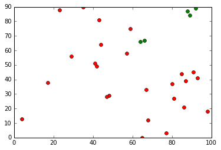

```python
import numpy as np
import matplotlib.pyplot as plt
from sklearn.cluster import KMeans

%matplotlib inline
```


```python
mathematics = [66,86,77,64,59,88,98,80,81,93,23,48,68,17,4,67,92,85,42,57,47,89,35,29,87,91,44,43,41,65]
english = [67,21,3,66,75,87,18,37,27,41,88,29,12,38,13,33,89,44,49,58,28,84,90,56,39,45,64,81,51,0]
```


```python
plt.plot(mathematics,english,'ro')
plt.show()
```


```python
_pass = []
_non_pass = []
for i in range(len(mathematics)):
    if mathematics[i] > 60 and english[i] > 60 :
        _pass.append([mathematics[i],english[i]])
    else :
        _non_pass.append([mathematics[i],english[i]])
```


```python
def getcol(martix_value,index):
    res = []
    for item in martix_value :
        res.append(item[index])
    return res
```


```python
plt.plot(getcol(_pass,0),getcol(_pass,1),'ro',c='g')
plt.plot(getcol(_non_pass,0),getcol(_non_pass,1),'ro',c='r')

plt.show()
```





```python
def getX():
    res = []
    for i in range(len(mathematics)):
        res.append([mathematics[i],english[i]])
    return res

```


    [[66, 67],
     [86, 21],
     [77, 3],
     [64, 66],
     [59, 75],
     [88, 87],
     [98, 18],
     [80, 37],
     [81, 27],
     [93, 41],
     [23, 88],
     [48, 29],
     [68, 12],
     [17, 38],
     [4, 13],
     [67, 33],
     [92, 89],
     [85, 44],
     [42, 49],
     [57, 58],
     [47, 28],
     [89, 84],
     [35, 90],
     [29, 56],
     [87, 39],
     [91, 45],
     [44, 64],
     [43, 81],
     [41, 51],
     [65, 0]]


```python
data_X = getX()
k_means = KMeans(n_clusters=2, random_state=2)
k_means.fit(data_X)
```


```python
k_means.cluster_centers_
```


    array([[ 71.8       ,  26.        ],
           [ 52.6       ,  69.53333333]])


```python
labels = k_means.labels_
cluster_1 = []
cluster_2 = []
for i in range(len(labels)) :
    if labels[i] > 0 :
        cluster_1.append(data_X[i])
    else:
        cluster_2.append(data_X[i])
```


```python
plt.plot(getcol(cluster_1,0),getcol(cluster_1,1),'ro',c='g')
plt.plot(getcol(cluster_2,0),getcol(cluster_2,1),'ro',c='r')

plt.show()
```


## mean-shift clustering algorithm
* http://scikit-learn.org/stable/auto_examples/cluster/plot_mean_shift.html#sphx-glr-auto-examples-cluster-plot-mean-shift-py


```python
print(__doc__)

import numpy as np
from sklearn.cluster import MeanShift, estimate_bandwidth
from sklearn.datasets.samples_generator import make_blobs

centers = [[1, 1], [-1, -1], [1, -1],[0.7,0.5],[1.8,0.9]]
X, _ = make_blobs(n_samples=10000, centers=centers, cluster_std=0.2)
```

    Automatically created module for IPython interactive environment


```python
# The following bandwidth can be automatically detected using
bandwidth = estimate_bandwidth(X, quantile=0.2, n_samples=500)

ms = MeanShift(bandwidth=bandwidth, bin_seeding=True)
ms.fit(X)
labels = ms.labels_
cluster_centers = ms.cluster_centers_

labels_unique = np.unique(labels)
n_clusters_ = len(labels_unique)

print("number of estimated clusters : %d" % n_clusters_)
```

    number of estimated clusters : 3


```python
import matplotlib.pyplot as plt
from itertools import cycle

plt.figure(1)
plt.clf()

colors = cycle('bgrcmykbgrcmykbgrcmykbgrcmyk')
for k, col in zip(range(n_clusters_), colors):
    my_members = labels == k
    cluster_center = cluster_centers[k]
    plt.plot(X[my_members, 0], X[my_members, 1], col + '.')
    plt.plot(cluster_center[0], cluster_center[1], 'o', markerfacecolor=col,
             markeredgecolor='k', markersize=14)
plt.title('Estimated number of clusters: %d' % n_clusters_)
plt.show()
```


## Color Quantization using K-Means


```python
# Authors: Robert Layton <robertlayton@gmail.com>
#          Olivier Grisel <olivier.grisel@ensta.org>
#          Mathieu Blondel <mathieu@mblondel.org>
#
# License: BSD 3 clause

print(__doc__)
import numpy as np
import matplotlib.pyplot as plt
from sklearn.cluster import KMeans
from sklearn.metrics import pairwise_distances_argmin
from sklearn.datasets import load_sample_image
from sklearn.utils import shuffle
from time import time

n_colors = 3

# Load the Summer Palace photo
china = load_sample_image("china.jpg")

# Convert to floats instead of the default 8 bits integer coding. Dividing by
# 255 is important so that plt.imshow behaves works well on float data (need to
# be in the range [0-1])
china = np.array(china, dtype=np.float64) / 255

# Load Image and transform to a 2D numpy array.
w, h, d = original_shape = tuple(china.shape)
assert d == 3
image_array = np.reshape(china, (w * h, d))

print("Fitting model on a small sub-sample of the data")
t0 = time()
image_array_sample = shuffle(image_array, random_state=0)[:1000]
kmeans = KMeans(n_clusters=n_colors, random_state=0).fit(image_array_sample)
print("done in %0.3fs." % (time() - t0))

# Get labels for all points
print("Predicting color indices on the full image (k-means)")
t0 = time()
labels = kmeans.predict(image_array)
print("done in %0.3fs." % (time() - t0))


codebook_random = shuffle(image_array, random_state=0)[:n_colors + 1]
print("Predicting color indices on the full image (random)")
t0 = time()
labels_random = pairwise_distances_argmin(codebook_random,
                                          image_array,
                                          axis=0)
print("done in %0.3fs." % (time() - t0))


def recreate_image(codebook, labels, w, h):
    """Recreate the (compressed) image from the code book & labels"""
    d = codebook.shape[1]
    image = np.zeros((w, h, d))
    label_idx = 0
    for i in range(w):
        for j in range(h):
            image[i][j] = codebook[labels[label_idx]]
            label_idx += 1
    return image

# Display all results, alongside original image
plt.figure(1)
plt.clf()
ax = plt.axes([0, 0, 1, 1])
plt.axis('off')
plt.title('Original image (96,615 colors)')
plt.imshow(china)

plt.figure(2)
plt.clf()
ax = plt.axes([0, 0, 1, 1])
plt.axis('off')
plt.title('Quantized image (64 colors, K-Means)')
plt.imshow(recreate_image(kmeans.cluster_centers_, labels, w, h))

plt.figure(3)
plt.clf()
ax = plt.axes([0, 0, 1, 1])
plt.axis('off')
plt.title('Quantized image (64 colors, Random)')
plt.imshow(recreate_image(codebook_random, labels_random, w, h))
plt.show()
```

    Automatically created module for IPython interactive environment
    Fitting model on a small sub-sample of the data
    done in 0.042s.
    Predicting color indices on the full image (k-means)
    done in 0.037s.
    Predicting color indices on the full image (random)
    done in 0.035s.


```python

```
